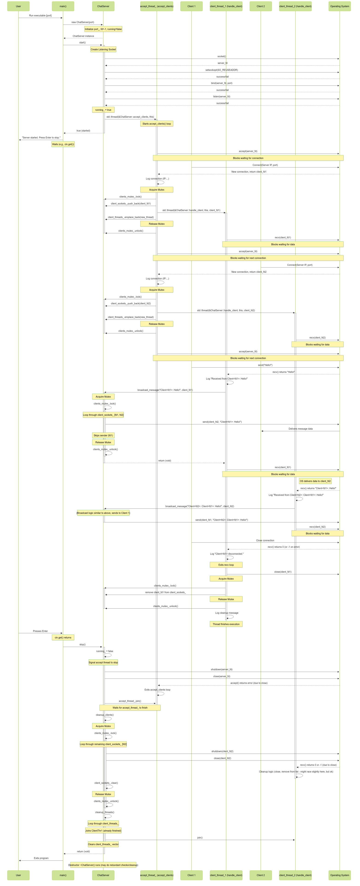

### Thought Process for Creating the `ChatServer` Class

#### Core Requirements
The `ChatServer` class is designed to implement a multithreaded chat server in C++. Key functionalities include:

1. **Networking:** Accept incoming client connections.
2. **Multithreading:** Handle each client connection in a separate thread to avoid blocking the main server loop.
3. **Communication:** Relay messages received from one client to all other connected clients.
4. **State Management:** Keep track of connected clients.
5. **Encapsulation:** Contain all server logic within the `ChatServer` class.

#### Key Components and Responsibilities
1. **Listening Socket:** Accept incoming connections on a specific port.
2. **Client Handling:** Accept connections and spawn threads for each client.
3. **Client Representation:** Store information about connected clients (e.g., socket descriptors).
4. **Message Broadcasting:** Send messages to all connected clients except the sender.
5. **Thread Management:** Manage threads created for each client.
6. **Concurrency Control:** Use mutexes to protect shared resources.
7. **Server Lifecycle:** Start the server (binding, listening) and stop it gracefully.

#### Technologies and Libraries
- **Networking:** POSIX sockets for Linux/macOS. (Windows requires Winsock adjustments.)
- **Threading:** `std::thread` from `<thread>`.
- **Concurrency:** `std::mutex` from `<mutex>` for locking shared data.
- **Data Structures:** `std::vector` for storing client sockets and threads.

#### Design of the `ChatServer` Class
1. **Constructor:** Initializes the server with a port number.
2. **`start()` Method:**
    - Creates the listening socket.
    - Binds the socket to the specified port.
    - Starts listening for connections.
    - Enters the main loop to accept clients and spawn threads.
3. **`handle_client()` Method (Private):**
    - Handles communication with a single client in its own thread.
    - Receives messages and broadcasts them to other clients.
    - Cleans up resources when the client disconnects.
4. **`broadcast_message()` Method (Private):**
    - Sends a message to all connected clients except the sender.
5. **`stop()` Method:**
    - Gracefully shuts down the server by stopping threads and closing sockets.
6. **Member Variables:**
    - `int port_`: Port number.
    - `int server_fd_`: Listening socket descriptor.
    - `std::vector<int> client_sockets_`: Stores connected client socket descriptors.
    - `std::vector<std::thread> client_threads_`: Stores threads handling clients.
    - `std::mutex clients_mutex_`: Protects access to shared resources.
    - `std::atomic<bool> running_`: Controls the server loop.

#### Refinements and Considerations
1. **Error Handling:** Add checks for socket function return values and log errors.
2. **Resource Management:** Ensure sockets are closed properly on errors or disconnections.
3. **Thread Safety:** Protect shared data (e.g., `client_sockets_`) with mutexes.
4. **Thread Cleanup:** Store `std::thread` objects to join them during shutdown.
5. **Message Framing:** Assume simple null-terminated strings for now; real-world servers need message framing.
6. **Platform Notes:** Add adjustments for Windows (e.g., Winsock initialization).

#### Implementation Steps
1. **Write the Code:** Implement the class based on the design, adding comments for clarity.
2. **Compile and Run:**
    - Save the code as `chat_server.cpp`.
    - Compile using:
      ```bash
      mkdir build && cd build
      cmake ..
      make
      ```
    - Run the server:
      ```bash
      ./chat_server [port]
      ```
3. **Connect Clients:** Use tools like `telnet` or `netcat` to connect to the server.

#### Caveats and Potential Improvements
- **Error Handling:** Improve robustness for production use.
- **Scalability:** Consider asynchronous I/O for handling a large number of clients.
- **Security:** Add encryption (e.g., TLS/SSL) and authentication.
- **Graceful Shutdown:** Implement more sophisticated signaling for thread termination.
- **Cross-Platform Support:** Add compatibility for Windows using Winsock.

### Sequence Diagram
